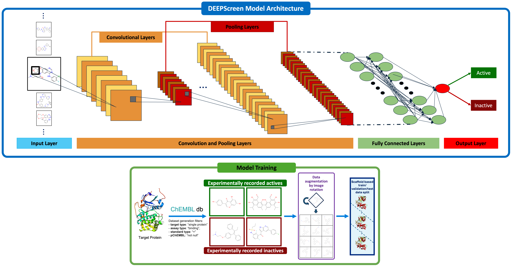

# DEEPScreen2: Deep Learning for Drug-Target Interaction Prediction

Computational models for drug–target interaction (DTI) prediction aim to reduce the cost of experimental screening, but often require complex molecular representations and long development cycles. Here we present DEEPScreen2, a modular, open-source framework that performs DTI prediction directly from RDKit-generated 2D molecular images, expanded with augmentation, using convolutional neural network and vision transformer backbones. DEEPScreen2 streamlines data curation, image generation, training and inference into an end-to-end pipeline that can be completed within seven days for a new target on standard hardware. Prospective applications to de novo design and drug repurposing identified two experimentally confirmed active molecules and two repurposed drugs, respectively. DEEPScreen2 thus demonstrates that simple image-based models can match or exceed traditional descriptor-based approaches for high-accuracy DTI prediction and rapid hypothesis generation.

<p align="center">
  
  <br>
  <em><strong>Figure 1.</strong> DEEPScreen2 system showcased over CNN architecture and image augmentation.</em>
</p>

## Key Features

*   **Automated Data Handling**: Automatically downloads, processes, and splits data from ChEMBL, MoleculeNet, and TDC.
*   **State-of-the-Art Architectures**: Supports both **CNN** (optimized resnet-like) and **Vision Transformers (ViT)** (SwinV2-based).
*   **Robust Preprocessing**: 300x300 image generation with 36-fold rotational augmentation for rotation-invariant predictions.
*   **Hyperparameter Optimization**: Integrated WandB sweeps for automated hyperparameter tuning.
*   **Task Agnostic**: Applicable to any binary classification task (bioavailability, toxicity, binding affinity) across various benchmarks.
*   **Easy Deployment**: Simple CLI for training, evaluation, and inference.

## Quickstart (5-10 Minutes)

Get started with a simple run on a ChEMBL target using the default CNN model.

1.  **Install Dependencies**:
    ```bash
    pip install -r requirements.txt
    ```

2.  **Run a Training Job**:
    This will download data for target `CHEMBL286`, split it, and train a model.
    ```bash
    python main_training.py \
        --target_id "CHEMBL286" \
        --assay_type "B" \
        --pchembl_threshold 6.0 \
        --model CNNModel1 \
        --en quickstart_demo \
        --project_name deepscreen_demo
    ```
    *Results will be saved in `result_files/experiments/` and `trained_models/`.*

## Installation

```bash
git clone https://github.com/HUBioDataLab/DEEPScreen2.git
cd DEEPScreen2
pip install -r requirements.txt
```

**Requirements**:
*   Python 3.x
*   PyTorch
*   RDKit
*   WandB (for logging and sweeps)
*   And others listed in `requirements.txt`

## Usage

DEEPScreen2 is controlled via `main_training.py` for training and `predict_deepscreen.py` for inference.

### 1. Task & Dataset Selection

**ChEMBL Target**:
```bash
python main_training.py --target_id CHEMBL286 --dataset chembl
```

**MoleculeNet Benchmark**:
```bash
python main_training.py --target_id bace --dataset moleculenet --scaffold --model ViT --muon
```

**Therapeutics Data Commons (TDC)**:

This should change according to the dataset you will use. For tox tasks, you should add tdc_tox as the dataset argument and tdc_adme otehrwise. (Only hERG is used as tox in our experiments.)
```bash
python main_training.py --target_id Bioavailability_Ma --dataset tdc_adme # or tdc_tox
```

### 2. Architecture Selection

You can select the model architecture globally using the `--model` flag.

*   **CNN (Default)**: Optimized Convolutional Network.
    ```bash
    --model CNNModel1
    ```
*   **Vision Transformer (ViT)**: SwinV2-based Transformer.
    ```bash
    --model ViT
    ```

### 3. Optimizer Selection

DEEPScreen2 supports multiple optimizers to suit different architectures.

*   **AdamW (Default)**: Standard optimizer, robust for most cases.
    *(Implicitly used if no other optimizer is specified)*
*   **Muon**: A momentum-based optimizer, highly recommended for **ViT** training due to better convergence properties.
    ```bash
    --muon
    ```

### 4. Hyperparameter Optimization

DEEPScreen2 supports automated hyperparameter tuning using Weights & Biases (WandB) Sweeps.

1.  **Configure Sweep**: Edit `sweep_cnn.yaml` or `sweep_vit.yaml` to define your search space (learning rate, batch size, architectural parameters).
2.  **Run Sweep**:
    ```bash
    python main_training.py --sweep --project_name --model your_model_name my_sweep_project --target_id CHEMBL286
    ```
    This will initialize a WandB sweep agent and start running experiments based on the configuration.

### 5. Prediction / Inference

Once a model is trained, use `predict_deepscreen.py` to screen new molecules.

```bash
python predict_deepscreen.py \
    --model_path trained_models/your_experiment_name/best_model.pth \
    --smiles_file prediction_files/your_compounds.csv \
    --target_id my_prediction_run
```
*   `--smiles_file`: A CSV containing SMILES strings to predict.
*   `--model_path`: Path to the `.pth` checkpoint file.

## Examples

Explore detailed use-cases in the `examples/` directory:

*   **[Monkeypox Viral DNA Polymerase](examples/monkeypox/README.md)**:
    Predicting active compounds against Monkeypox virus using data from DrugBank and literature.
*   **[DrugGEN Generated Molecules](examples/druggen/README.md)**:
    Screening molecules generated by the DrugGEN model for specific target activity.

## Project Structure

```
DEEPScreen2/
├── examples/               # Specific use-case examples (Monkeypox, DrugGEN)
├── config/                 # Configuration files
│   ├── config.yaml         # Default training & runtime 
│   ├── sweep_cnn.yaml      # WandB sweep configuration for CNN
|   └── sweep_vit.yaml      # WandB sweep configuration for ViT 
├── main_training.py        # Main entry point for training
├── train_deepscreen.py     # Training logic and loops
├── predict_deepscreen.py   # Inference script
├── models.py               # Model definitions (CNNModel1, ViT)
├── data_processing.py      # Data loading and image generation
└── requirements.txt        # Python dependencies
```

## Coming Soon / In Progress

*   **YOLO Support**: We are working on integrating YOLO-based object detection architectures for more interpretable feature localization on molecular images. Stay tuned!

# ⚠️ Deterministic CUDA Warning

This project enables deterministic behavior in PyTorch (e.g. via
torch.use_deterministic_algorithms(True)).

If you are running on CUDA ≥ 10.2, some GPU operations (notably matrix multiplications using CuBLAS) are not deterministic by default.
Without additional configuration, PyTorch may raise a runtime error or produce non-reproducible results.

To ensure deterministic behavior, you must set the following environment variable before running the code:

export CUBLAS_WORKSPACE_CONFIG=:4096:8


(Alternatively, :16:8 can be used for slightly better performance.)

Important:
This environment variable must be set before starting the Python process.
Setting it inside the code will not work.

If strict reproducibility is not required, deterministic mode can be disabled instead.

## Citations

If you use DEEPScreen2 in your research, please cite our relevant works:

```bibtex
@misc{unlu2025deepscreen,
  title={DEEPScreen2: A Modular Image-Based Deep Learning Framework for Drug–Target Interaction Prediction},
  author={{\"U}nl{\"u}, Atabey and {\c{C}}al{\i}{\c{s}}kan, Mehmet Furkan and {\.I}nan, Furkan Necati and {\"O}rer, Kemal and {\"O}rer, Kerem and Do{\u{g}}an, Tunca},
  year={2025},
  howpublished={\url{https://github.com/HUBioDataLab/DEEPScreen2}}
}
```

---
**License**: [MIT](LICENSE) | **Contributing**: Pull requests are welcome!